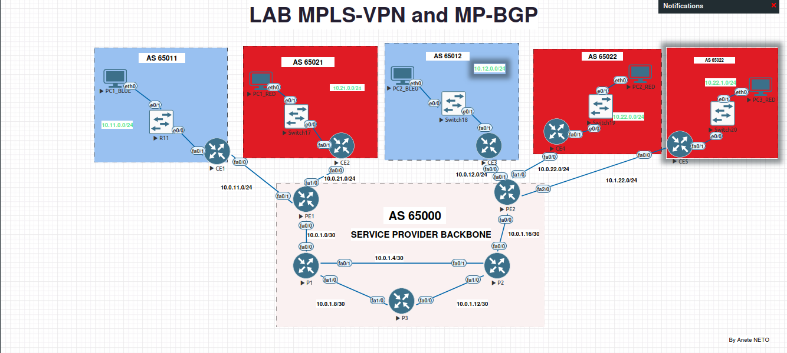

# 🖧 LAB – MPLS-VPN & MP-BGP  
### Provider Backbone & Multi-Client Isolation Lab

  

---
## 🎯 Overview

This lab focuses on deploying a **full service-provider MPLS backbone**, including:

- **OSPF** as IGP  
- **MPLS + LDP** for transport  
- **VRF** for customer isolation  
- **MP-BGP** for VPNv4 route exchange  
- **MPLS-TE tunnels** for path control  

Two customers (**BLUE** and **RED**) are deployed across multiple locations and connected through the provider network **AS 65000**, while remaining strictly isolated.

---

## 🎯 Objectives

- Build private networks for two enterprise customers  
- Isolate customers using **VRFs**  
- Deploy an MPLS backbone with **OSPF + LDP + MP-BGP**  
- Transport inter-site routes using **VPNv4**  
- Experiment with **explicit TE tunnels** for path steering  

---

## 🏗️ Architecture & Technologies

### Provider Backbone — AS 65000
- OSPF backbone  
- MPLS + LDP  
- MP-BGP for VPNv4  
- MPLS-TE tunnels (via R3 / via R5)

### Customers
- **BLUE customer : AS 65011**  
- **RED customer : AS 65021 / AS 65022**  
- VRFs `bleu` and `rouge`  
- Separate routing tables per customer  

---

## 🛠️ Tasks Completed

- Enabled **OSPF + MPLS** across backbone routers  
- Created and configured **VRFs**  
- Configured **MP-BGP** for VPNv4 routing  
- Validated BLUE/RED isolation  
- Built **explicit MPLS-TE tunnels**  
- Analyzed MPLS forwarding and label operations  
- Captured traffic in Wireshark for MPLS packet analysis  

---

## 🧠 Skills Gained

- Practical understanding of **MPLS service-provider networks**  
- Confident use of **VRFs** for customer isolation  
- **VPNv4** routing with MP-BGP  
- **MPLS label analysis** (stacking, encapsulation)  
- Traffic-engineering with explicit tunnels  
- Advanced troubleshooting: **OSPF, LDP, MP-BGP, VRF** routing  

---

## 🔗 Useful Links
- 📘 **TP PDF** : `/dosc/TP-mpls-vpn.pdf`  
- 🧪 **Configurations** : folder `/configs`  
- 🖥️ **Topology** : folder `/topology`  

